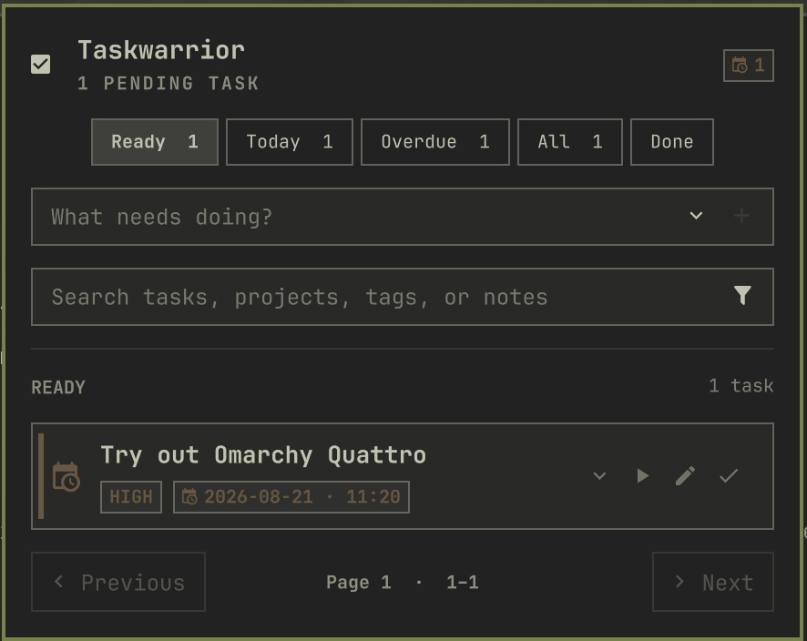

# Omarchy Taskwarrior

[](https://github.com/AliSayyah/omarchy-taskwarrior/actions/workflows/ci.yml)

A native [Omarchy](https://omarchy.org/) QuickShell plugin for managing [Taskwarrior](https://taskwarrior.org/) from the bar.



## Features

- Ready, Today, Overdue, All, and Done views
- Quick task creation with optional project, tag, priority, and due-date controls
- Search across descriptions, projects, tags, and annotations
- Filter chips for active, blocked, waiting, project, and tag views
- Task completion with a timed Restore action and restore controls in Done
- Start and stop Taskwarrior time tracking
- Inline task editing for description, project, priority, and due date
- Two-line task previews with a full in-panel detail view
- Native calendar and time picker
- Active and overdue bar indicators
- Paginated pending and completed task lists
- Theme-aware Omarchy controls and colors
- In-panel Taskwarrior installation prompt when `task` is unavailable

## Install

```bash
omarchy plugin add https://github.com/AliSayyah/omarchy-taskwarrior.git --enable
```

Run this from an interactive terminal: Omarchy will ask whether to place the widget on the **left**, **center**, or **right** of the bar. Right is preselected as the default, but you can choose any section.

For an existing installation, move it at any time:

```bash
omarchy bar move taskwarrior --section left
omarchy bar move taskwarrior --section center
omarchy bar move taskwarrior --section right
```

Taskwarrior is available from Arch's `task` package; if it is missing, the plugin offers to install it through `omarchy pkg add task`.

## Use

- Left-click the bar widget to open the panel.
- Right-click the widget to refresh.
- Use the filter buttons to switch task views.
- Search tasks directly or open the filter control for state, project, and tag chips.
- Expand the add field to set project, tags, priority, and due date before creating a task.
- Use the row actions to start or stop tracking, edit, or complete a task.
- Restore a completion from its confirmation message or from the Done view.
- Open the detail chevron on any task to read its full description and annotations.
- Use Previous and Next to move through task pages.

## Update

```bash
omarchy plugin update taskwarrior
```

## Remove

```bash
omarchy plugin remove taskwarrior
```

## Requirements

- Omarchy 4.0 or newer
- Taskwarrior 3.x; the plugin can install it when missing

## Development

The repository root is the plugin root. Runtime boundaries are intentionally small:

- `Panel.qml` composes the bar widget and popup.
- `TaskwarriorController.qml` owns Taskwarrior subprocesses and state.
- `Model.js` handles parsing, filtering, and datetime conversion.
- `components/` contains independent visual components.

Run all local checks on Omarchy:

```bash
./scripts/check
```

Pull requests and pushes run portable model, structure, manifest, shell, and QML syntax checks in a clean Arch Linux container. A validated push to `main` publishes a GitHub Release for `manifest.json`'s version when that release does not already exist.

Saved QML files hot-reload. If QuickShell retains an older component instance, run:

```bash
omarchy restart shell
```

## License

[MIT](LICENSE)
